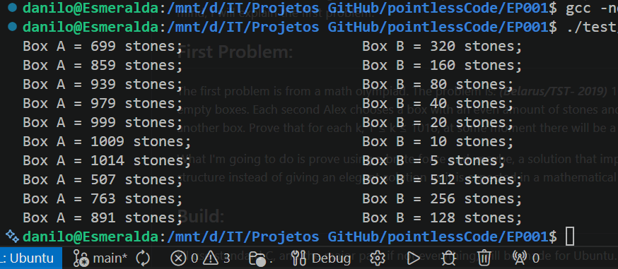

# Directory tree of EP001

Directory tree of '.':

.
├── asm
│   └── random.asm
├── generate_tree.sh
├── header
│   └── tools.h
├── obj
│   ├── random.o
│   ├── tools.o
│   └── udst.o
├── src
│   ├── Stones-belarusTST2019.c
│   └── tools.c
├── test
│   ├── buildTest
│   └── understanding.c
└── tree_output.md

